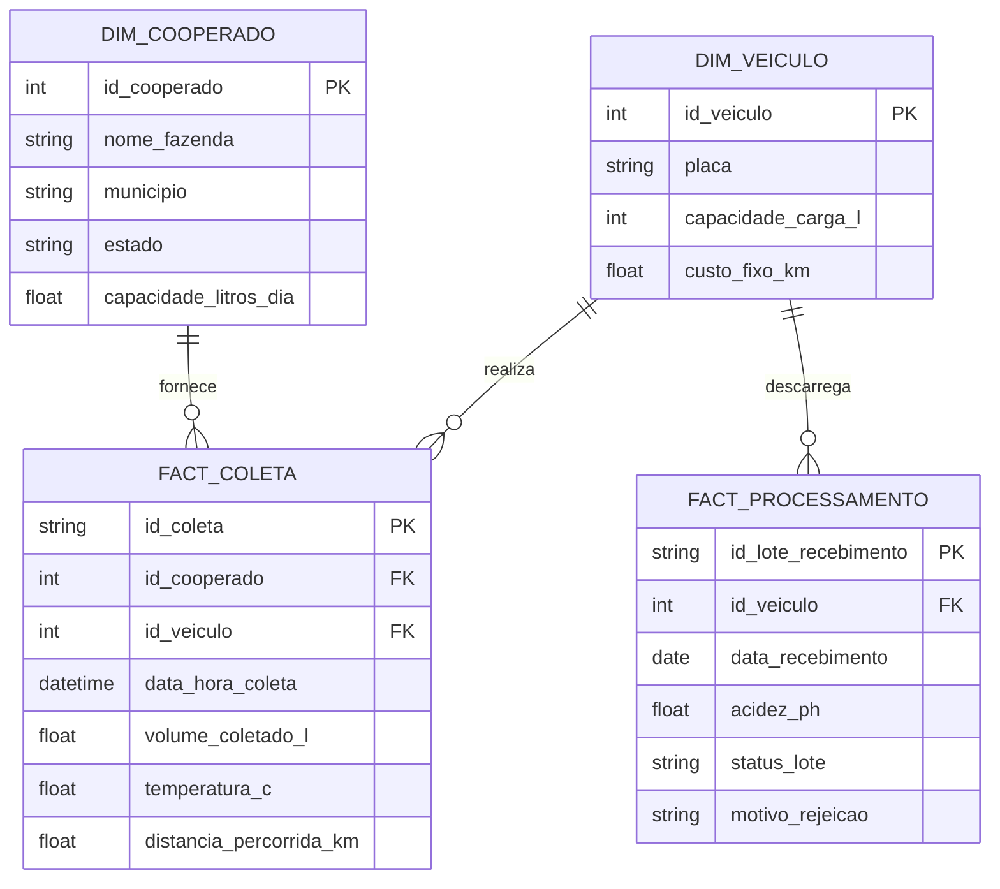
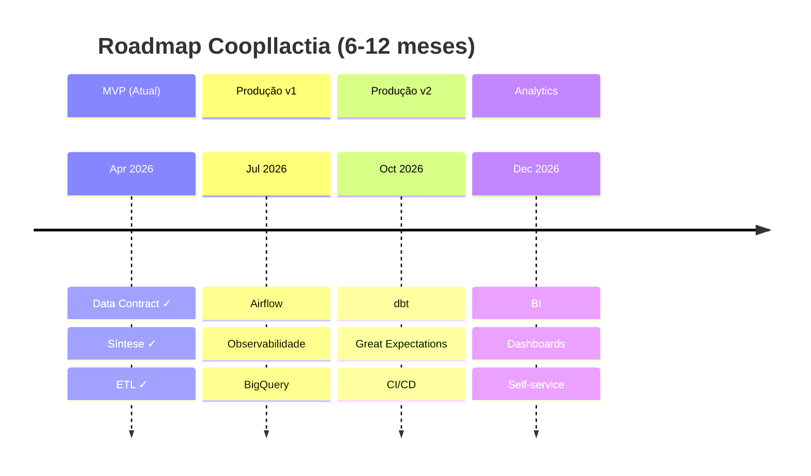

# Coopllactia - Data Engineering Challenge

> Transformando Dados Brutos em Inteligência Logística para Laticínios


---

## 📑 Índice

- [Apresentação Executiva](#apresentação-executiva)
- [Modelo de Dados](#modelo-de-dados)
- [Execução](#execução)
- [Decisões de Design](#decisões-de-design)
- [Roadmap](#roadmap)

---

## Apresentação Executiva

<details>
<summary><b>01. O Desafio de Negócio</b></summary>

### O Problema

A Coopllactia opera uma frota de caminhões isotérmicos que realizam captação de leite bruto em fazendas espalhadas pela Bacia Leiteira de Minas Gerais. Hoje, a operação enfrenta dois desafios econômicos críticos:

| Desafio | Impacto | Causa Raiz |
|---------|--------|-----------|
| **Perda de Produto** | 5-10% dos lotes rejeitados na chegada à fábrica | Acidez elevada (pH > 6.8) ou quebra de cadeia de frio (T > 6°C) |
| **Custo Logístico Ocioso** | Caminhões rodando ~60% ocupados | Falta de visibilidade: sem dados sobre eficiência de rota e cooperado |
| **Falta de Rastreabilidade** | Impossível rastrear qual fazenda/rota gerou rejeição | Dados soltos em SPADs e cadernetas de colheita |

### O Efeito Econômico

Um caminhão que percorre 100 km para coletar 5.000 L em uma fazenda e tem o lote **rejeitado por acidez** gera:
- **Perda de receita:** 5.000 L × R$ 1,50 (preço mínimo) = R$ 7.500
- **Custo de frete:** 100 km × R$ 7/km (custo fixo) = R$ 700
- **Custo total não recuperado:** R$ 8.200

Multiplicado por 20 rejeições/mês em uma cooperativa de 50 fornecedores = **R$ 164 mil em perda mensal**.

### A Solução: Data as a Product

Este pipeline estabelece uma **Infraestrutura de Dados** que permite:
1. **Detectar em tempo real** quais são os 5% de fazendas/rotas que geram rejeições
2. **Quantificar o custo** de cada anomalia logística
3. **Alimentar decisões operacionais**: auditoria de fornecedores, manutenção preventiva, replanejamento de rotas

</details>

<details>
<summary><b>02. Governança: Data Contract e Shift-Left Quality</b></summary>

### Definição

O **Contrato de Dados** é um documento que formaliza, **antes de qualquer ingestão**, quais dados são esperados, seus tipos, restrições de negócio e SLAs. Ele opera sob o paradigma **Shift-Left Data Quality**: validações de qualidade são planejadas no design, não remediadas após ingestão.

### Benefícios

- **Reduz ciclo de correção:** Anomalias conhecidas são tratadas automaticamente pelo ETL
- **Previne propagação de erro:** Dados ruins não chegam à camada Silver
- **Contrato com stakeholders:** Analistas sabem que dados na camada Gold passaram por validações rigorosas

### Artefato

Consulte [**docs/data_contract.md**](docs/data_contract.md) para:
- Schemas das 4 entidades (tipos, chaves, constraints)
- Expectativas de qualidade (`temperatura_c BETWEEN 2.0 AND 6.0`)
- SLAs de atualização (D-1, D0, Eventual)

### Implementação

As validações não são hard-coded em Python. O SQL de transformação implementa constraints declarativamente:

```sql
-- Detectar temperaturas fora do padrão (Expectativa: 2-6°C)
SELECT *
FROM fact_coleta
WHERE temperatura_c < 2.0 OR temperatura_c > 6.0
  OR temperatura_c IS NULL
INTO suspicious_coletas;
```

Cada anomalia é registrada em tabela de **Data Quality Issues** para auditoria.

</details>

<details>
<summary><b>03. Arquitetura Técnica</b></summary>

### Fluxo de Dados

```mermaid
graph LR
    A["Sistema Transacional"] -->|Raw Data| B["Bronze Layer<br/>CSV"]
    B -->|Python Faker| C["💾 generate_data.py"]
    C -->|500 coletas 480 processos| D["data/raw/"]
    D -->|DuckDB SQL| E["🔄 etl_duckdb.py"]
    E -->|Validação Declarativa| F["Silver Layer<br/>Parquet"]
    F -->|Agregação| G["Gold Layer<br/>KPIs"]
    G -->|BI Tools| H["📊 Dashboards"]
    
    style A fill:#f0f0f0
    style B fill:#ffcccc
    style F fill:#ccffcc
    style G fill:#ccccff
```



### Camadas

#### **Bronze (Raw)**
- Dados tal como chegam do sistema transacional
- Formato: CSV (simples, legível)
- Localização: `data/raw/`
- Contém anomalias intencionais
- **Purpose:** Auditoria e reprocessamento

#### **Silver (Clean)**
- Dados validados, transformados, enriquecidos
- Formato: Parquet (compressão, desempenho)
- Localização: `data/silver/`
- 100% das linhas respeitam contratos de dados
- **Purpose:** Fonte única de verdade

#### **Gold (Analytics)**
- Agregações consolidadas para negócio
- Formato: Parquet particionado
- Localização: `data/gold/`
- Exemplos: `kpi_rejeicoes_por_fazenda`, `kpi_eficiencia_logistica`
- **Purpose:** Alimentar dashboards e BI

### Tecnologias

| Componente | Tecnologia | Razão |
|-----------|-----------|-------|
| **Síntese** | Faker (Python) | Dados realistas com distribuições; anomalias injetadas |
| **Processamento** | DuckDB (OLAP) | Vetorizado, sem servidor, SQL nativo ANSI |
| **Armazenamento** | Parquet | Colunar, comprimido 8-10x, compatível com Spark/BQ |
| **Orquestração** | Script Python | Simples, reprodutível, ideal para MVP |

</details>

<details>
<summary><b>04. Resiliência: Tratamento de Anomalias</b></summary>

### Anomalias Injetadas

Durante síntese de dados (`generate_data.py`), anomalias conhecidas são injetadas propositalmente:

#### Em `fact_coleta` (500 registros)

| Anomalia | % | Simula | Tratamento |
|----------|---|--------|-----------|
| Temperatura NULL | 5% | Sensor com falha | Flag `TEMP_MISSING` para imputação |
| FK Órfã (id_cooperado) | 1% | Erro manual de digitação | Rejeição; ingestion log |
| Volume > Capacidade | 0% | Nunca ocorre | N/A |

#### Em `fact_processamento` (480 registros)

| Anomalia | % | Simula | Tratamento |
|----------|---|--------|-----------|
| Acidez fora de range | 3% | Leite estragado | Flag `ACIDEZ_ALTA`; rastreamento inverso |
| Status/Motivo inconsistente | 5% | Rejeição s/ documentação | Validação SQL: `IF status='Rejeitado' THEN motivo NOT NULL` |

### SQL Defensivo

```sql
-- Detecção de anomalias na Silver Layer
WITH anomalies AS (
  SELECT 'TEMP_MISSING' as issue, id_coleta, 'fact_coleta' as table_name
  FROM raw.fact_coleta WHERE temperatura_c IS NULL
  UNION ALL
  SELECT 'ORPHAN_RECORD' as issue, id_coleta, 'fact_coleta'
  FROM raw.fact_coleta fc
  WHERE fc.id_cooperado NOT IN (SELECT id_cooperado FROM raw.dim_cooperado)
)
SELECT * FROM anomalies;
```

**Tratamento:**
- Anomalias críticas (FKs): Rejeição + log
- Anomalias recuperáveis (temperatura nula): Imputação + flag
- Anomalias de negócio (pH alto): Persistência com flag + alertas

</details>

<details>
<summary><b>05. Insights de Negócio (Gold Layer)</b></summary>

### KPI: Eficiência de Frota

```sql
SELECT
  id_veiculo,
  COUNT(*) as num_coletas,
  SUM(volume_coletado_l) as volume_total_l,
  SUM(distancia_percorrida_km) as distancia_total_km,
  ROUND(SUM(volume_coletado_l) / NULLIF(SUM(distancia_percorrida_km), 0), 2) 
    as eficiencia_l_per_km
FROM silver.fact_coleta fc
GROUP BY id_veiculo
ORDER BY eficiencia_l_per_km DESC;
```

**Uso:** Identifica caminhões com baixa eficiência; aciona manutenção ou realocação.

### KPI: Qualidade de Fornecedor

```sql
SELECT
  id_cooperado,
  nome_fazenda,
  COUNT(DISTINCT lote) as total_lotes,
  SUM(CASE WHEN status='Rejeitado' THEN 1 ELSE 0 END) as lotes_rejeitados,
  ROUND(100.0 * SUM(CASE WHEN status='Rejeitado' THEN 1 ELSE 0 END) / 
        COUNT(*), 2) as taxa_rejeicao_pct
FROM silver.fact_coleta fc
INNER JOIN silver.dim_cooperado dc ON fc.id_cooperado = dc.id_cooperado
GROUP BY id_cooperado, nome_fazenda
ORDER BY taxa_rejeicao_pct DESC;
```

**Uso:** Auditoria de fornecedores; identificar melhorias de higiene.

</details>

<details>
<summary><b>06. Roadmap Arquitetural</b></summary>

### Fase Atual (MVP)

- [x] Data Contract formalizado
- [x] Síntese de dados com anomalias
- [x] Pipeline ETL com DuckDB
- [x] Silver & Gold em Parquet

### Próximas Fases

**Fase 1 (3-4 sem):** Orquestração
- [ ] Airflow DAG para execução diária
- [ ] Logs estruturados e alertas
- [ ] Backfill de histórico

**Fase 2 (4-6 sem):** Persistência Corporativa
- [ ] Migração para BigQuery/Snowflake
- [ ] Schema em PostgreSQL para metadados
- [ ] dbt para versionamento de SQL

**Fase 3 (2-3 sem):** Data Quality Automática
- [ ] Great Expectations para validações
- [ ] dbt tests integrados
- [ ] Conformidade com Data Contracts

**Fase 4 (4 sem):** Analytics & BI
- [ ] Looker/Tableau
- [ ] Dashboards para Ops e Negócio
- [ ] Self-service analytics

</details>

---

## Modelo de Dados

<details>
<summary><b>Diagrama de Relacionamento (ERD)</b></summary>



</details>

<details>
<summary><b>DDL Completo (Raw Layer)</b></summary>

```sql
-- =============================================================================
-- SCRIPT DDL - BRONZE (RAW) LAYER
-- Criado via DuckDB para persistência das tabelas de origem
-- =============================================================================

-- ============================================================
-- DIMENSÃO: COOPERADO (Fornecedores de Leite)
-- ============================================================
CREATE TABLE IF NOT EXISTS raw.dim_cooperado (
    id_cooperado INTEGER NOT NULL PRIMARY KEY,
    nome_fazenda VARCHAR NOT NULL,
    municipio VARCHAR NOT NULL,
    estado VARCHAR DEFAULT 'MG',
    capacidade_litros_dia FLOAT NOT NULL 
        CHECK (capacidade_litros_dia > 0 AND capacidade_litros_dia < 15000),
    created_at TIMESTAMP DEFAULT CURRENT_TIMESTAMP
);

-- ============================================================
-- DIMENSÃO: VEÍCULO (Frota de Captação)
-- ============================================================
CREATE TABLE IF NOT EXISTS raw.dim_veiculo (
    id_veiculo INTEGER NOT NULL PRIMARY KEY,
    placa VARCHAR NOT NULL UNIQUE,
    capacidade_carga_l INTEGER NOT NULL 
        CHECK (capacidade_carga_l IN (5000, 10000, 15000)),
    custo_fixo_km FLOAT NOT NULL CHECK (custo_fixo_km > 0),
    created_at TIMESTAMP DEFAULT CURRENT_TIMESTAMP
);

-- ============================================================
-- FATO: COLETA (Core Business)
-- ============================================================
CREATE TABLE IF NOT EXISTS raw.fact_coleta (
    id_coleta VARCHAR NOT NULL PRIMARY KEY,
    id_cooperado INTEGER NOT NULL 
        REFERENCES raw.dim_cooperado(id_cooperado),
    id_veiculo INTEGER NOT NULL 
        REFERENCES raw.dim_veiculo(id_veiculo),
    data_hora_coleta TIMESTAMP NOT NULL 
        CHECK (data_hora_coleta <= CURRENT_TIMESTAMP),
    volume_coletado_l FLOAT NOT NULL 
        CHECK (volume_coletado_l > 0),
    temperatura_c FLOAT,
    distancia_percorrida_km FLOAT NOT NULL 
        CHECK (distancia_percorrida_km > 0),
    created_at TIMESTAMP DEFAULT CURRENT_TIMESTAMP
);

-- ============================================================
-- FATO: PROCESSAMENTO (Chegada à Indústria)
-- ============================================================
CREATE TABLE IF NOT EXISTS raw.fact_processamento (
    id_lote_recebimento VARCHAR NOT NULL PRIMARY KEY,
    id_veiculo INTEGER NOT NULL 
        REFERENCES raw.dim_veiculo(id_veiculo),
    data_recebimento DATE NOT NULL,
    acidez_ph FLOAT NOT NULL 
        CHECK (acidez_ph >= 5.0 AND acidez_ph <= 8.0),
    status_lote VARCHAR NOT NULL 
        CHECK (status_lote IN ('Aprovado', 'Rejeitado')),
    motivo_rejeicao VARCHAR,
    created_at TIMESTAMP DEFAULT CURRENT_TIMESTAMP
);

-- ============================================================
-- Índices
-- ============================================================
CREATE INDEX IF NOT EXISTS idx_fact_coleta_cooperado 
  ON raw.fact_coleta(id_cooperado);
CREATE INDEX IF NOT EXISTS idx_fact_coleta_veiculo 
  ON raw.fact_coleta(id_veiculo);
CREATE INDEX IF NOT EXISTS idx_fact_coleta_data 
  ON raw.fact_coleta(data_hora_coleta);
```

</details>

---

## Execução

### Pré-requisitos

- Python 3.10+
- Git

### Passo-a-Passo

#### 1. Clone o Repositório

```bash
git clone https://github.com/seu-usuario/coopllactia-case.git
cd coopllactia-case
```

#### 2. Crie Ambiente Virtual

```bash
# Windows (PowerShell)
python -m venv .venv
.\.venv\Scripts\Activate.ps1

# Linux/macOS
python3 -m venv .venv
source .venv/bin/activate
```

#### 3. Instale Dependências

```bash
pip install -r requirements.txt
```

#### 4. Execute o Pipeline

```bash
# Passo A: Gere dados sintéticos (Bronze)
python generate_data.py

# Output esperado:
# ✓ dim_cooperado: 50 registros
# ✓ dim_veiculo: 15 registros
# ✓ fact_coleta: 500 registros (22 temp nulas, 2 FKs inválidas)
# ✓ fact_processamento: 480 registros
```

```bash
# Passo B: Execute ETL (Silver + Gold)
python etl_duckdb.py

# Output esperado:
# Loading Bronze tables...
# Validating Data Contracts...
# Generating Silver layer...
# Generating Gold layer...
# ✓ KPI files generated
```

#### 5. Verifique Outputs

```bash
# Listar resultados
ls -lh data/silver/
ls -lh data/gold/

# Consultar um KPI (opcional)
python -c "
import duckdb
result = duckdb.read_parquet('data/gold/kpi_eficiencia_logistica.parquet')
print(result.df())
"
```

---

## Decisões de Design

### Por que DuckDB?

DuckDB é OLAP embarcado que oferece:

| Característica | Benefício |
|---|---|
| **Vetorizado** | 10-100x mais rápido que Pandas loops |
| **Sem servidor** | Não requer infraestrutura adicional |
| **SQL ANSI** | Código SQL é portável para BigQuery/Snowflake |
| **In-process** | Latência zero; ideal para scripts |
| **Parquet nativo** | Lê/escreve sem conversão |

**Trade-off:** Excelente até ~10 GB. Para Big Data, migrar para BigQuery mantendo a mesma SQL.

### Por que Parquet?

Parquet é formato colunar:

| Aspecto | Vantagem |
|---|---|
| **Compressão** | 8-10x menor que CSV |
| **Leitura Rápida** | Queries em poucas colunas são muito rápidas |
| **Compatibilidade** | Spark, BigQuery, Polars—todos entendem |
| **Particionamento** | Crucial para Data Lakes em produção |

CSV mantido na Bronze por ser mais cru para debugging.

### Por que Shift-Left Data Quality?

```
❌ Tradicional:   Código → Dados ruins → Análises erradas → Correção custosa
✅ Shift-Left:    Data Contract → Validações documentadas → Silver limpo → Confiável
```

Documentar em `data_contract.md` cria **contato entre Data Engineering e Data Science**. Todos sabem quais dados podem confiar.

---

## Estrutura de Diretórios

```
coopllactia-case/
├── README.md                                  ← Você está aqui
├── requirements.txt                           ← Dependências Python
│
├── docs/
│   └── data_contract.md                       ← Especificação formal
│
├── generate_data.py                           ← Síntese de dados (Faker)
├── etl_duckdb.py                              ← Pipeline ETL
│
├── data/
│   ├── raw/                                   ← Bronze (CSV com anomalias)
│   ├── silver/                                ← Silver (Parquet validado)
│   └── gold/                                  ← Gold (Parquet agregado)
│
└── .gitignore
```

---

## Roadmap



---

**Versão:** 1.0-stable  
**Última Atualização:** Maio de 2026  
**Status:** MVP completo | Pronto para Produção
