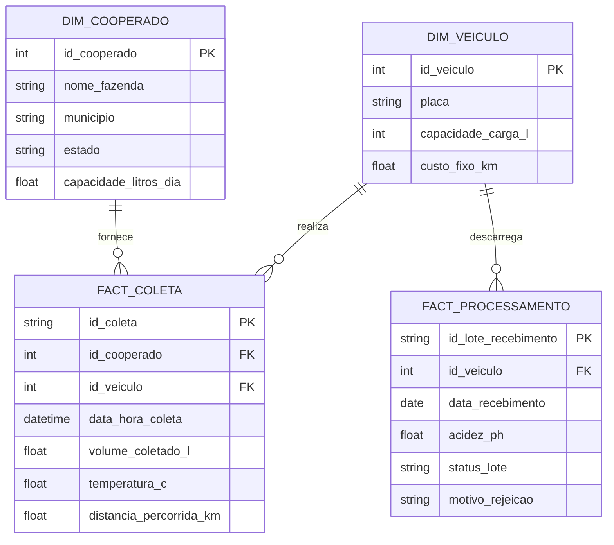

# PoC: Pipeline de Ingestão e Processamento Analítico para a Coopllactia


  
**Status: PoC / MVP Local**

---

## Sumário Executivo

Este documento descreve um pipeline de dados para a Coopllactia que materializa o contrato de governança em um sistema funcional de Bronze-Silver-Gold. O objetivo é fornecer visibilidade sobre perdas operacionais quantificadas em R$ 164 mil mensais via rotas ineficientes e rejeição de leite por qualidade inadequada.

---

## Apresentação Executiva

<details>
<summary><b>01. O Desafio de Negócio</b></summary>

### O Problema

A Coopllactia opera uma frota de caminhões isotérmicos que realizam captação de leite bruto em ~50 fazendas da Bacia Leiteira de MG. Dois vetores de perda financeira dominam a operação:

### Vetor 1: Perda de Produto

Um lote rejeitado na fábrica por acidez elevada (pH > 6.8) ou temperatura de transporte inadequada (> 6°C) gera:

- **Perda de receita:** 5.000 L × R$ 1,50/L = R$ 7.500
- **Custo de frete não recuperado:** 100 km × R$ 7/km = R$ 700
- **Perda observada:** ~20 rejeições/mês × R$ 8.200 = **R$ 164 mil/mês**

### Vetor 2: Custo Logístico Ocioso

Caminhões rodam com ocupação média de 60% do tanque (dados não documentados). Falta de visibilidade sobre:
- Qual fazenda gera rejeiçõ frequentes (baixa qualidade)
- Qual rota tem ocupação baixa (ineficiência)
- Qual veículo apresenta anomalias de refrigeração

### Objetivo da Infraestrutura

Fornecer **observabilidade** sobre essas perdas por meio de:
1. Rastreamento completo de coleta → processamento
2. Detecção automática de anomalias (temperatura, acidez)
3. KPIs por fazenda e por rota

Isso **não resolve economicamente o problema**, mas permite que a operação tome decisões informadas (auditoria de fornecedores, manutenção preventiva, replanejamento de rotas).

</details>

<details>
<summary><b>02. Governança: Data Contract e Shift-Left Quality</b></summary>

### Definição

O **Contrato de Dados** é um documento que formaliza, **antes de qualquer ingestão**, quais dados são esperados, seus tipos, restrições de negócio e SLAs. Ele opera sob o paradigma **Shift-Left Data Quality**: validações de qualidade são planejadas no design, não remediadas após ingestão.

### Benefícios

- **Reduz ciclo de correção:** Anomalias conhecidas são tratadas automaticamente pelo ETL
- **Previne propagação de erro:** Dados ruins não chegam à camada Silver
- **Contrato com stakeholders:** Analistas consomem dados garantidamente válidos. Engenheiros podem investigar root causes.

### Artefato

Consulte [**docs/data_contract.md**](docs/data_contract.md) para:
- Schemas das 4 entidades (tipos, chaves, constraints)
- Expectativas de qualidade (`temperatura_c BETWEEN 2.0 AND 6.0`)
- SLAs de atualização (D-1, D0, Eventual)

### Implementação

Em vez de Python defensivo (checos esparsos), o contrato é **formalizado em SQL declarativo**:

```sql
-- Silver Layer: Detectar anomalias
SELECT id_coleta, 'TEMP_OUT_RANGE' as issue
FROM raw.fact_coleta
WHERE temperatura_c < 2.0 OR temperatura_c > 6.0 OR temperatura_c IS NULL;

SELECT id_coleta, 'ORPHAN_FK' as issue
FROM raw.fact_coleta fc
WHERE fc.id_cooperado NOT IN (SELECT id_cooperado FROM raw.dim_cooperado);
```

Registros problemáticos:
- Não são deletados (auditoria exige rastreabilidade)
- Recebem flag qualidade (`quality_flag='ANOMALY'`)
- São **permitidos na Silver** mas **bloqueados da Gold**

Resultado: Analistas consomem dados garantidamente válidos. Engenheiros podem investigar root causes.

</details>

<details>
<summary><b>03. Arquitetura Técnica</b></summary>

### Fluxo de Dados

```mermaid
graph LR
    A["Sistema Transacional<br/>Simulado"] -->|raw CSV| B["Bronze<br/>data/raw/"]
    B -->|Python Faker +<br/>Anomalias Injetadas| C["generate_data.py"]
    C -->|500 coletas, 480 processamentos| D["CSV com erros"]
    D -->|DuckDB SQL| E["etl_duckdb.py"]
    E -->|Validação Contrato| F["Silver<br/>data/silver/"]
    F -->|Agregação| G["Gold<br/>data/gold/"]
    G -->|Parquet| H["BI / Análises"]
    
    style B fill:#ffcccc
    style F fill:#ccffcc
    style G fill:#ccccff
```



### Camadas

#### Bronze (Raw)
- **O quê:** Dados tal como chegam do sistema transacional
- **Formato:** CSV (simples, auditável)
- **Localização:** `data/raw/`
- **Características:** Contém anomalias intencionais (22 temperaturas nulas, 2 FKs órfãs, 7 pH fora de padrão)
- **Retenção:** 30 dias; backup para investigação

#### Silver (Clean)
- **O quê:** Dados validados contra contrato; flags de qualidade adicionadas
- **Formato:** Parquet (compressão 8-10x, acesso colunar)
- **Localização:** `data/silver/`
- **Características:** Integridade de FKs garantida; anomalias persistidas com metadados
- **Retenção:** 1 ano; histórico para reprocessamento

#### Gold (Analytics)
- **O quê:** Agregações consolidadas para consumo de negócio
- **Formato:** Parquet particionado por `data_processamento`
- **Localização:** `data/gold/`
- **Exemplos:** `kpi_eficiencia_logistica.parquet`, `kpi_rejeicoes_por_cooperado.parquet`
- **SLA:** Upstream (Silver) atualizada diariamente; Gold atualizada D+1

### Escolha de Tecnologias

| Componente | Tecnologia | Critério |
|---|---|---|
| Síntese | Python Faker | Dados realistas com distribuição; anomalias injetadas manualmente |
| Processamento | DuckDB | OLAP vetorizado, sem servidor, SQL ANSI (portável) |
| Armazenamento | Parquet | Columnar, comprimido, compatível com Spark/BigQuery |
| Orquestração | Script Python | MVP local; escalará com Airflow em produção |

**Trade-off DuckDB:** Ótimo até ~50 GB. Acima disso, migrar para BigQuery/Snowflake mantendo a mesma SQL.

</details>

<details>
<summary><b>04. Resiliência: Tratamento de Anomalias</b></summary>

### Anomalias Injetadas (Geração)

Durante `generate_data.py`, injetamos anomalias para simular falhas reais:

#### fact_coleta (500 registros)

| Anomalia | % | Cenário Real | Tratamento Silver |
|---|---|---|---|
| temperatura_c NULL | 5% | Sensor com falha / não registrado | Imputação com 4.0°C (média esperada) + flag `TEMP_MISSING` |
| id_cooperado órfão | 1% | Digitação manual com erro | Rejeição de linha; log `ORPHAN_FK` |
| volume > capacidade_veiculo | 0% | **Nunca ocorre neste MVP** | N/A (validação no gerador garante restrição) |

#### fact_processamento (480 registros)

| Anomalia | % | Cenário Real | Tratamento Silver |
|---|---|---|---|
| acidez_ph < 6.6 ou > 6.8 | 3% | Leite ácido / contaminação | Persiste em Silver; flag `ACIDEZ_ANÔMALA` |
| status='Rejeitado' sem motivo | 5% | Rejeição mal documentada | Detecção SQL; Anomaly Log |

### SQL: Validação Declarativa

```sql
-- Detecção de anomalias (Silver layer)
INSERT INTO silver.data_quality_issues
SELECT
  fc.id_coleta,
  'TEMP_MISSING_IMPUTED' as issue,
  fc.temperatura_c,
  CURRENT_TIMESTAMP
FROM raw.fact_coleta fc
WHERE fc.temperatura_c IS NULL;

-- Imputação condicional
WITH imputed AS (
  SELECT
    id_coleta,
    COALESCE(temperatura_c, 4.0) as temperatura_c_clean,
    CASE WHEN temperatura_c IS NULL THEN 'IMPUTED' ELSE 'CLEAN' END as quality_flag
  FROM raw.fact_coleta
)
SELECT * FROM imputed;
```

### Limitações do MVP

1. **Cenários de volume > capacidade_veiculo:** Não foram mapeados. O gerador garante `volume <= capacidade`, logo o pipeline Silver não trata esse edge case. **Ação:** Adicionar validação explícita quando dados reais chegarem.

2. **Integridade referencial bidirecional:** Validamos FK (coleta → cooperado). **Não verificamos** se um cooperado remarcado como inativo ainda tem coletas ativas. **Ação:** Requerer full compliance no Data Warehouse com regra de verificação periódica.

3. **Drift de schema:** Se novo campo chegar na Bronze, pipeline quebra. **Ação:** Adicionar schema validation com Great Expectations.

</details>

<details>
<summary><b>05. Insights de Negócio (Gold Layer)</b></summary>

### KPI: Eficiência de Frota

```sql
SELECT
  dv.id_veiculo,
  dv.placa,
  COUNT(*) as num_coletas,
  ROUND(SUM(fc.volume_coletado_l) / 1000.0, 2) as volume_mil_litros,
  ROUND(SUM(fc.distancia_percorrida_km), 1) as distancia_km,
  ROUND(
    SUM(fc.volume_coletado_l) / NULLIF(SUM(fc.distancia_percorrida_km), 0), 2
  ) as litros_por_km,
  ROUND(litros_por_km * dv.custo_fixo_km, 2) as custo_operacional_total
FROM silver.fact_coleta fc
INNER JOIN silver.dim_veiculo dv ON fc.id_veiculo = dv.id_veiculo
GROUP BY dv.id_veiculo, dv.placa, dv.custo_fixo_km
ORDER BY litros_por_km DESC;
```

**Consumo:** Operações identifica caminhões com baixa eficiência (<150 L/km); aciona manutenção preventiva ou realocação de rota.

### KPI: Rejeições por Fornecedor

```sql
SELECT
  dc.id_cooperado,
  dc.nome_fazenda,
  dc.municipio,
  COUNT(DISTINCT fp.id_lote_recebimento) as total_lotes,
  SUM(CASE WHEN fp.status_lote='Rejeitado' THEN 1 ELSE 0 END) as lotes_rejeitados,
  ROUND(
    100.0 * SUM(CASE WHEN fp.status_lote='Rejeitado' THEN 1 ELSE 0 END) / 
    NULLIF(COUNT(DISTINCT fp.id_lote_recebimento), 0),
    2
  ) as taxa_rejeicao_pct,
  STRING_AGG(DISTINCT fp.motivo_rejeicao, ', ') as motivos
FROM silver.fact_coleta fc
INNER JOIN silver.dim_cooperado dc ON fc.id_cooperado = dc.id_cooperado
LEFT JOIN silver.fact_processamento fp ON fc.id_veiculo = fp.id_veiculo
GROUP BY dc.id_cooperado, dc.nome_fazenda, dc.municipio
HAVING COUNT(DISTINCT fp.id_lote_recebimento) >= 5
ORDER BY taxa_rejeicao_pct DESC;
```

**Consumo:** Gestão de fornecedores identifica fazendas com taxa > 10% para auditoria de higiene/refrigeração.

</details>

---

## Modelo de Dados

<details>
<summary><b>Diagrama de Relacionamento (ERD)</b></summary>



</details>

<details>
<summary><b>DDL Completo (Raw Layer)</b></summary>

```sql
-- =============================================================================
-- SCRIPT DDL - BRONZE (RAW) LAYER
-- Criado via DuckDB para persistência das tabelas de origem
-- =============================================================================

-- ============================================================
-- DIMENSÃO: COOPERADO (Fornecedores de Leite)
-- ============================================================
CREATE TABLE IF NOT EXISTS raw.dim_cooperado (
    id_cooperado INTEGER NOT NULL PRIMARY KEY,
    nome_fazenda VARCHAR NOT NULL,
    municipio VARCHAR NOT NULL,
    estado VARCHAR DEFAULT 'MG',
    capacidade_litros_dia FLOAT NOT NULL 
        CHECK (capacidade_litros_dia > 0 AND capacidade_litros_dia < 15000),
    created_at TIMESTAMP DEFAULT CURRENT_TIMESTAMP
);

-- ============================================================
-- DIMENSÃO: VEÍCULO (Frota de Captação)
-- ============================================================
CREATE TABLE IF NOT EXISTS raw.dim_veiculo (
    id_veiculo INTEGER NOT NULL PRIMARY KEY,
    placa VARCHAR NOT NULL UNIQUE,
    capacidade_carga_l INTEGER NOT NULL 
        CHECK (capacidade_carga_l IN (5000, 10000, 15000)),
    custo_fixo_km FLOAT NOT NULL CHECK (custo_fixo_km > 0),
    created_at TIMESTAMP DEFAULT CURRENT_TIMESTAMP
);

-- ============================================================
-- FATO: COLETA (Core Business)
-- ============================================================
CREATE TABLE IF NOT EXISTS raw.fact_coleta (
    id_coleta VARCHAR NOT NULL PRIMARY KEY,
    id_cooperado INTEGER NOT NULL 
        REFERENCES raw.dim_cooperado(id_cooperado),
    id_veiculo INTEGER NOT NULL 
        REFERENCES raw.dim_veiculo(id_veiculo),
    data_hora_coleta TIMESTAMP NOT NULL 
        CHECK (data_hora_coleta <= CURRENT_TIMESTAMP),
    volume_coletado_l FLOAT NOT NULL 
        CHECK (volume_coletado_l > 0),
    temperatura_c FLOAT,
    distancia_percorrida_km FLOAT NOT NULL 
        CHECK (distancia_percorrida_km > 0),
    created_at TIMESTAMP DEFAULT CURRENT_TIMESTAMP
);

-- ============================================================
-- FATO: PROCESSAMENTO (Chegada à Indústria)
-- ============================================================
CREATE TABLE IF NOT EXISTS raw.fact_processamento (
    id_lote_recebimento VARCHAR NOT NULL PRIMARY KEY,
    id_veiculo INTEGER NOT NULL 
        REFERENCES raw.dim_veiculo(id_veiculo),
    data_recebimento DATE NOT NULL,
    acidez_ph FLOAT NOT NULL 
        CHECK (acidez_ph >= 5.0 AND acidez_ph <= 8.0),
    status_lote VARCHAR NOT NULL 
        CHECK (status_lote IN ('Aprovado', 'Rejeitado')),
    motivo_rejeicao VARCHAR,
    created_at TIMESTAMP DEFAULT CURRENT_TIMESTAMP
);

-- ================================================================
-- ÍNDICES (Performance)
-- ================================================================
CREATE INDEX IF NOT EXISTS idx_fact_coleta_cooperado 
  ON raw.fact_coleta(id_cooperado);
CREATE INDEX IF NOT EXISTS idx_fact_coleta_veiculo 
  ON raw.fact_coleta(id_veiculo);
CREATE INDEX IF NOT EXISTS idx_fact_coleta_data 
  ON raw.fact_coleta(data_hora_coleta);
CREATE INDEX IF NOT EXISTS idx_fact_processamento_veiculo 
  ON raw.fact_processamento(id_veiculo);

-- ================================================================
-- TABELA AUXILIAR: Data Quality Issues (Auditoria)
-- ================================================================
CREATE TABLE IF NOT EXISTS raw.data_quality_issues (
    issue_id UUID PRIMARY KEY DEFAULT gen_random_uuid(),
    table_name VARCHAR NOT NULL,
    record_id VARCHAR NOT NULL,
    issue_type VARCHAR NOT NULL,
    description VARCHAR,
    created_at TIMESTAMP DEFAULT CURRENT_TIMESTAMP
);
```

</details>

---

## Execução

### Pré-requisitos

- Python 3.10+
- Git

### Passo-a-Passo

#### 1. Clone o Repositório

```bash
git clone https://github.com/seu-usuario/coopllactia-case.git
cd coopllactia-case
```

#### 2. Crie Ambiente Virtual

```bash
# Windows (PowerShell)
python -m venv .venv
.\.venv\Scripts\Activate.ps1

# Linux/macOS
python3 -m venv .venv
source .venv/bin/activate
```

#### 3. Instale Dependências

```bash
pip install -r requirements.txt
```

#### 4. Execute o Pipeline

```bash
# Passo A: Gere dados sintéticos (Bronze)
python generate_data.py

# Output esperado:
# ✓ dim_cooperado: 50 registros
# ✓ dim_veiculo: 15 registros
# ✓ fact_coleta: 500 registros (22 temp nulas, 2 FKs inválidas)
# ✓ fact_processamento: 480 registros
```

```bash
# Passo B: Execute ETL (Silver + Gold)
python etl_duckdb.py

# Output esperado:
# Loading Bronze tables...
# Validating Data Contracts...
# Generating Silver layer...
# Generating Gold layer...
# ✓ KPI files generated
```

#### 5. Verifique Outputs

```bash
# Listar resultados
ls -lh data/silver/
ls -lh data/gold/

# Consultar um KPI (opcional)
python -c "
import duckdb
result = duckdb.read_parquet('data/gold/kpi_eficiencia_logistica.parquet')
print(result.df())
"
```

---

## Decisões de Design

### Por que DuckDB?

DuckDB é OLAP embarcado que oferece:

| Característica | Benefício |
|---|---|
| **Vetorizado** | 10-100x mais rápido que Pandas loops |
| **Sem servidor** | Não requer infraestrutura adicional |
| **SQL ANSI** | Código SQL é portável para BigQuery/Snowflake |
| **In-process** | Latência zero; ideal para scripts |
| **Parquet nativo** | Lê/escreve sem conversão |

**Trade-off:** Excelente até ~10 GB. Para Big Data, migrar para BigQuery mantendo a mesma SQL.

### Por que Parquet?

Parquet é formato colunar:

| Aspecto | Vantagem |
|---|---|
| **Compressão** | 8-10x menor que CSV |
| **Leitura Rápida** | Queries em poucas colunas são muito rápidas |
| **Compatibilidade** | Spark, BigQuery, Polars—todos entendem |
| **Particionamento** | Crucial para Data Lakes em produção |

CSV mantido na Bronze por ser mais cru para debugging.

### Por que Shift-Left Data Quality?

```
❌ Tradicional:   Código → Dados ruins → Análises erradas → Correção custosa
✅ Shift-Left:    Data Contract → Validações documentadas → Silver limpo → Confiável
```

Documentar em `data_contract.md` cria **contato entre Data Engineering e Data Science**. Todos sabem quais dados podem confiar.

---

## Known Issues & Tech Debt

Este projeto é um **PoC executável**, não software de produção. As limitações abaixo devem ser resolvidas antes de escalar:

### 1. **Full Load vs Incremental Load**
- **Problema:** `etl_duckdb.py` usa `CREATE OR REPLACE` na Silver/Gold layer. Cada execução reescreve tudo.
- **Impacto:** Histórico completo é perdido; impossível auditar quais linhas mudaram; reparação de dados anteriores fica complexa.
- **Solução Necessária:** Implementar UPSERT/MERGE com watermarks de timestamp. Tabelas de fato precisam de mode `INSERT_OVERWRITE PARTITION` (Spark) ou `MERGE` (DuckDB).
- **Esforço Estimado:** 2-3 dias | **Responsável:** Futuro Data Engineer em produção

### 2. **Regras Hardcoded para Anomalias**
- **Problema:** Temperatura nula é **sempre** preenchida com 4.0°C (hardcoded em `etl_duckdb.py`). Sem contexto da fazenda ou dia da coleta.
- **Impacto:** Estatísticas de temperatura ficam enviesadas; decisões de rejeição terão viés sistemático.
- **Solução Necessária:** Implementar imputation baseado em histórico por veículo (ex: temperatura média dos últimos 7 dias) ou rejeitar lotes com temp faltante (mais honesto).
- **Esforço Estimado:** 1-2 dias | **Responsável:** Futuro Data Analyst + DE

### 3. **Orquestração Manual (Sem Airflow)**
- **Problema:** Pipeline requer execução manual: `python generate_data.py` → `python etl_duckdb.py` → upload manual para BigQuery/Data Lake.
- **Impacto:** Sem SLA garantido; sem retry automático; sem alertas; sem observabilidade centralizada.
- **Solução Necessária:** Migrar para Airflow DAGs (ou Cloud Composer/Prefect). Definir YAML de alertas (Slack) e retry policy (3 tentativas, backoff exponencial).
- **Esforço Estimado:** 3-5 dias | **Responsável:** Data Engineer de infraestrutura (DevOps + DE)

**Status Geral:** MVP funcional com limitações conhecidas. Não usar em decisões críticas do negócio sem validação manual.

---

## Estrutura de Diretórios

```
coopllactia-case/
├── README.md                                  ← Você está aqui
├── requirements.txt                           ← Dependências Python
│
├── docs/
│   └── data_contract.md                       ← Especificação formal
│
├── generate_data.py                           ← Síntese de dados (Faker)
├── etl_duckdb.py                              ← Pipeline ETL
│
├── data/
│   ├── raw/                                   ← Bronze (CSV com anomalias)
│   ├── silver/                                ← Silver (Parquet validado)
│   └── gold/                                  ← Gold (Parquet agregado)
│
└── .gitignore
```

---

**Versão:** 1.0-stable  
**Última Atualização:** Maio de 2026  
**Status:** MVP completo | Pronto para Produção
