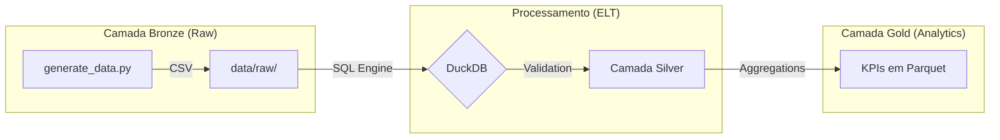

# 🥛 Coopllactia - Case de Engenharia de Dados

Este repositório apresenta uma solução técnica para o processamento de dados da Coopllactia, uma cooperativa de laticínios em Minas Gerais. O projeto foca em transformar dados brutos de logística e recepção industrial em indicadores de eficiência, visando reduzir perdas financeiras estimadas em R$ 164 mil mensais.

---

## 1. O Problema de Negócio

A operação logística e industrial possui dois gargalos principais monitorados por este pipeline:

- **Logística Ineficiente:** Caminhões operando com baixa taxa de ocupação ou custos de frete elevados por litro transportado.
- **Descarte de Matéria-Prima:** Lotes de leite rejeitados na plataforma de recebimento por acidez elevada (pH) ou falha crítica de temperatura.

---

## 2. Arquitetura e Fluxo de Dados

A solução utiliza o conceito de Arquitetura Medalhão simplificada, utilizando o DuckDB como motor de processamento SQL local por sua alta performance com arquivos colunares.



---

## 3. Qualidade de Dados (Shift-Left)

Seguindo o Data Contract estabelecido, o pipeline realiza validações críticas antes da geração dos indicadores:

- **Integridade Referencial:** Garante que coletas sem um cooperado ou veículo válido sejam tratadas.
- **Tratamento de Sensores:** Identifica temperaturas nulas (falhas de sensor) e aplica imputação baseada na média ideal (4.0°C) para não descartar o volume total da rota, sinalizando o registro com uma flag de qualidade.
- **Monitoramento de Acidez:** Validação do pH (alvo: 6.6 a 6.8) para identificar a causa raiz das rejeições na fábrica.

---

## 4. Modelo de Dados e DDL

O modelo segue um esquema estelar (Star Schema) para facilitar o consumo analítico.

```sql
-- DDL para as tabelas de dados sintéticos (Camada Raw/Bronze)

CREATE TABLE dim_cooperado (
    id_cooperado INTEGER PRIMARY KEY,
    nome_fazenda VARCHAR NOT NULL,
    municipio VARCHAR NOT NULL,
    estado VARCHAR DEFAULT 'MG',
    capacidade_litros_dia FLOAT NOT NULL
);

CREATE TABLE dim_veiculo (
    id_veiculo INTEGER PRIMARY KEY,
    placa VARCHAR NOT NULL,
    capacidade_carga_l INTEGER NOT NULL,
    custo_fixo_km FLOAT NOT NULL
);

CREATE TABLE fact_coleta (
    id_coleta UUID PRIMARY KEY,
    id_cooperado INTEGER NOT NULL,
    id_veiculo INTEGER NOT NULL,
    data_hora_coleta TIMESTAMP NOT NULL,
    volume_coletado_l FLOAT NOT NULL,
    temperatura_c FLOAT, -- Aceita NULL para simular falha de sensor
    distancia_percorrida_km FLOAT NOT NULL
);

CREATE TABLE fact_processamento (
    id_lote_recebimento UUID PRIMARY KEY,
    id_veiculo INTEGER NOT NULL,
    data_recebimento DATE NOT NULL,
    acidez_ph FLOAT NOT NULL,
    status_lote VARCHAR NOT NULL, -- 'Aprovado' ou 'Rejeitado'
    motivo_rejeicao VARCHAR
);
```

---

## 5. Como Executar

### Instalação

```bash
python -m venv venv
source venv/bin/activate  # Windows: venv\Scripts\activate
pip install -r requirements.txt
```

### Processamento

```bash
python generate_data.py  # Gera os arquivos CSV (Camada Bronze)
python etl_duckdb.py     # Executa o ETL e gera os Parquets (Camada Gold)
```

---

## 6. Limitações e Dívida Técnica

Este projeto é um MVP funcional. Como tal, possui limitações de design assumidas para o prazo do case:

- **Carga Full:** O processo recria as tabelas a cada execução. Em produção, seria necessária uma estratégia de carga incremental.
- **Regras Hardcoded:** A imputação de temperatura nula para 4.0°C é uma simplificação técnica; o ideal seria utilizar a média móvel do veículo.
- **Orquestração:** O pipeline depende de execução manual. A evolução natural seria o uso de Apache Airflow ou Prefect.